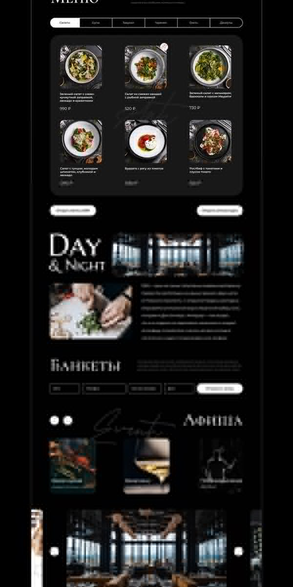
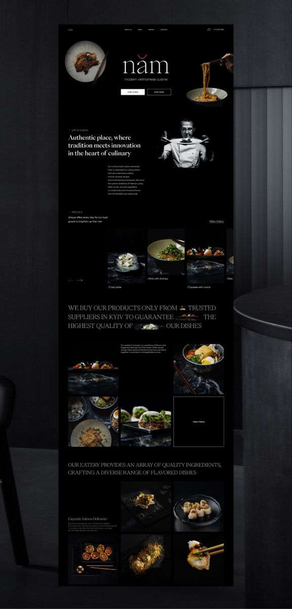
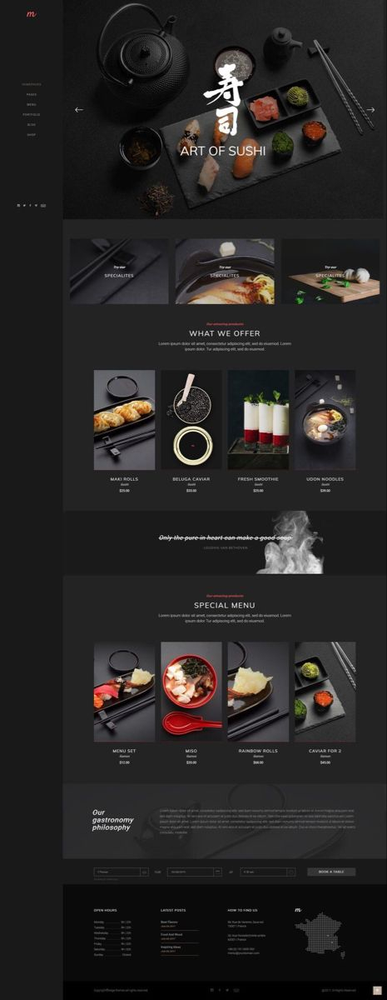
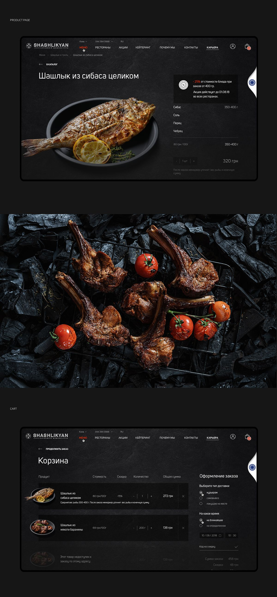
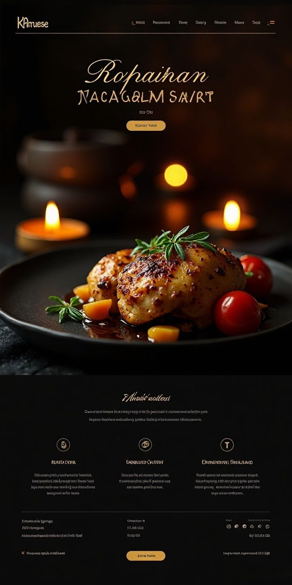
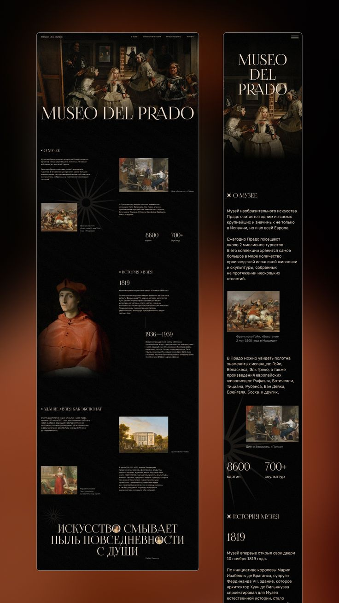

# Мудборд «Рыбец 64»

Личная подборка референсов для исследования визуального направления «Рыбец 64» и подготовки коммерческого предложения.

Связанные документы: [концепция лендинга](landing-proposal.md) и [концепция интернет-магазина](store-proposal.md).

## Общий вектор

- Тёмная премиальная подача без ощущения типового интернет-магазина.
- Продуктовая фотография — главный носитель эмоции и качества.
- Сочетание редакционной типографики с простой функциональной навигацией.
- Глубокий чёрный, графит, тёплые пищевые оттенки и редкие, но заметные золотые акценты.
- Много воздуха, крупные изображения и асимметричная, но управляемая композиция.
- Каталог и корзина должны оставаться предельно понятными: выразительность не должна ухудшать покупку.

## Рабочее направление: ювелирный минимализм

Визуальный код бренда можно сохранить через сочетание чёрного, золота и насыщенных оттенков продукта, но подать его сдержаннее и точнее. Задача — не отказаться от понятного бренду образа роскоши, а очистить его от избыточного декора и сделать визуально дороже.

- Золото работает как драгоценная деталь: в логотипе, ключевых заголовках, тонких линиях, отдельных рамках и активных состояниях.
- Первый экран может быть намеренно торжественным, чтобы сразу обозначить характер бренда.
- Следующие секции становятся спокойнее: крупные фотографии, направленный свет, глубокий фон, много воздуха и редкие золотые подписи.
- Основное впечатление создают масштаб, композиция, качество фотографии и контраст материалов, а не количество декоративных элементов.
- Не переносим буквально золотые рамки вокруг каждого блока, повторяющиеся пиктограммы, кристаллы и постоянный эффект блеска.

Это направление остаётся рабочей проектной гипотезой и требует проверки на дизайн-концепте.

## Референсы

### 01 — Dark editorial menu

Что берём: компактные табы категорий, тёмные карточки, редакционные секции и сочетание каталога с историей бренда. Не берём мелкий текст и чрезмерно низкий контраст.

### 02 — Dark asymmetric restaurant

Что берём: асимметричную сетку, крупную антикву, коллажную подачу блюд и ощущение высокой кухни. Для магазина потребуется более явная продуктовая навигация и CTA.

### 03 — Sushi modular catalog

Что берём: чёткие товарные модули, разделение ассортимента на подборки и спокойную графитовую палитру. Полезный ориентир для листинга, но без визуальной монотонности одинаковых карточек.

### 04 — Charcoal product and cart

Что берём: продукт как герой страницы, фактурный фон, крупную фотографию, компактный состав и цельную тёмную корзину. Это наиболее прямой референс для карточки товара и checkout-flow.

### 05 — Warm cinematic food

Что берём: тёплый свет, аппетитный крупный план, сдержанный золотой акцент и атмосферу вечерней премиальности. Не переносим декоративные шрифты в интерфейсные элементы.

### 06 — Editorial museum layout

Что берём: сильную типографическую иерархию, вертикальный ритм, свободную композицию и хорошую адаптацию редакционного подхода на мобильный экран. Использовать прежде всего для истории бренда и производства.

## Практическая формула

Будущее направление можно описать так: **музейная драматургия 06 + атмосфера 02 и 05 + продуктовая страница 04 + каталог 03, собранные в логике ювелирного минимализма**.

При проектировании обязательно сохранить:

- быстрый доступ к каталогу, поиску и корзине;
- заметные цену, вес, наличие и условия доставки;
- читаемый текст и достаточный контраст;
- удобную мобильную покупку;
- самостоятельный характер бренда «Рыбец 64», а не копию ресторанных референсов.
